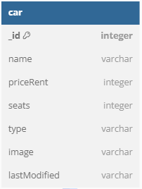

# Cars Dashboard

KALIAN BIKIN :

1. Database Diagram

ini database diagram dari challenge chapter 4 Car Management Dashboard :

2. Configuration :
   - git clone ..
   - npm install
   - buat file .env, copy env variable dari .env.example
   - npm run dev

### localhost:3000/

3. View Page

- /dashboard/ = get all cars page
- /dashboard/create (GET) = ini halaman untuk create new car
- /dashboard/create (POST) = ini api action untuk create new car
- /dashboard/edit?id=\_ID_DATA (GET) = ini halaman untuk edit car
- /dashboard/edit?id=\_ID_DATA (POST)
- /dashboard/delete/\_ID_DATA (GET) = ini api action untuk delete car
- ........................
